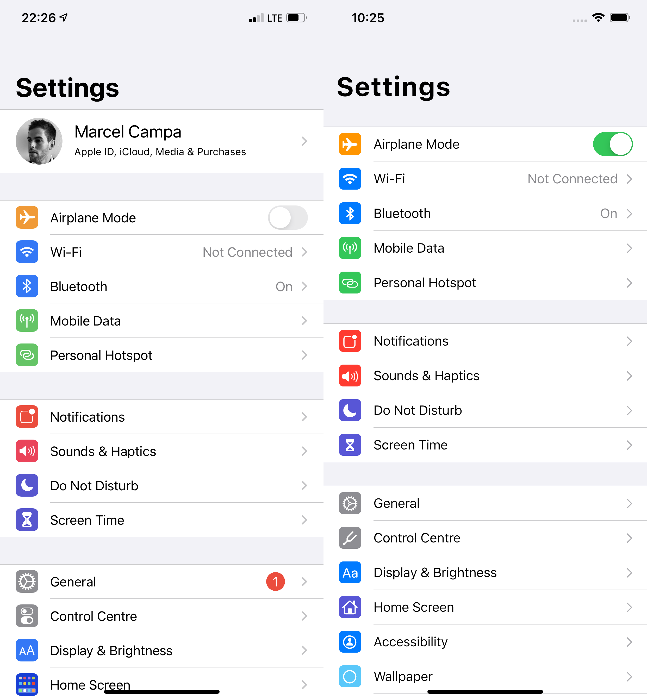

# iOS Settings App

This is an example usage of base `CupertinoListSection` and `CupertinoListTile` with leading
widgets. The example mimicks the *Settings app* from iOS 14.4.

## Example

On the left is a screenshot from actual device, on the right is the result of this implementation.

