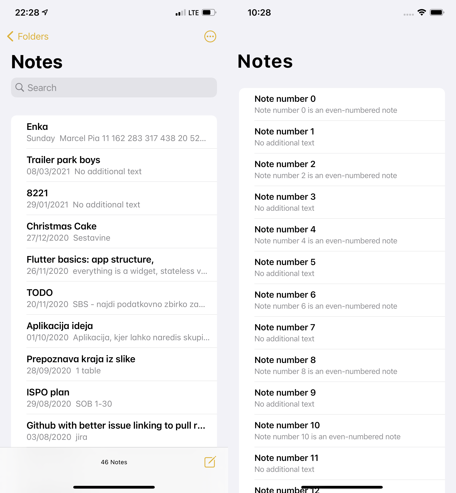

# iOS Notes App

This is an example usage of "Inset-Grouped" `CupertinoListSection` and `CupertinoListTile` without leading
widgets. The example mimicks the *Notes app* from iOS 14.4.

## Example

On the left is a screenshot from actual device, on the right is the result of this implementation.

